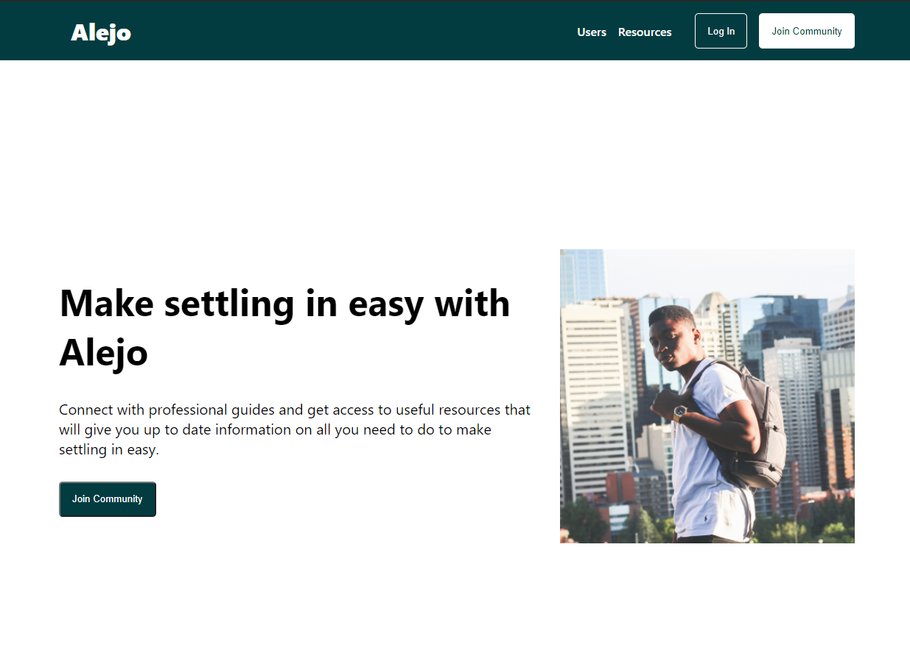
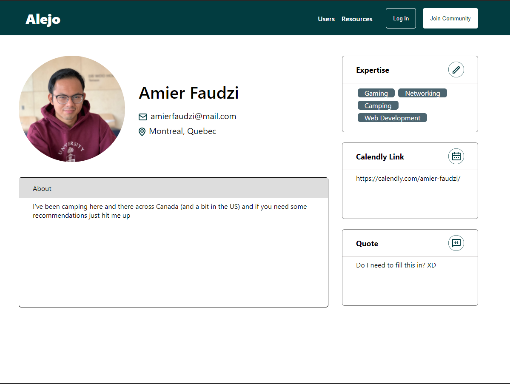
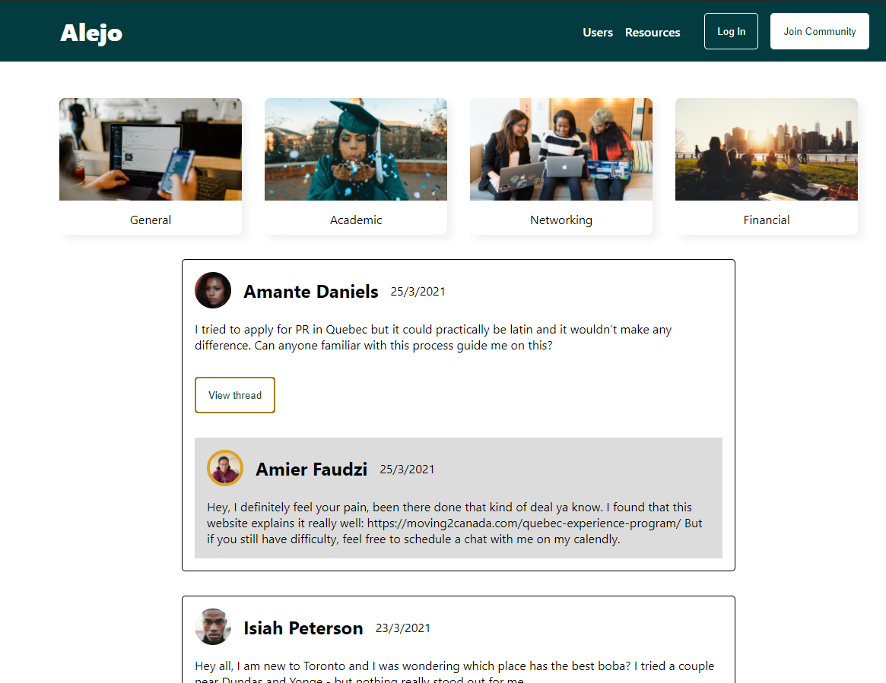

# Project Alejo

## Introduction
Alejo seeks to aid international students studying in Canada the supports and resources required to quickly get up to speed with adjusting and thriving in Canada. Alejo comes from a Yoruban word that means visitor. It was produced over a 5 weeks in collaboration with a project manager and designer under the Co.Lab program. The website was built using the GAMR stack [Graphql, Apollo, MongoDB, React]. GraphQL allows for rapid front end iteration as well as a guided backend development and changes.

The live site: https://alejo-canada.netlify.app/ 

A typical guide profile that would show their bio, interest, and how to reach them,

A user could ask questions and give answers related to life in Canada.

## Open Issues
1. Users cannot edit their profile photo - route not established
2. Users cannot edit their profile information - bad request need to investigate
3. Users that does not have their profile filled out cannot post a reply/post - back-end route addQuestion/addAnswer

## Future Plans
1. Adding a state management to effectively handle users when they login
2. Fix issues